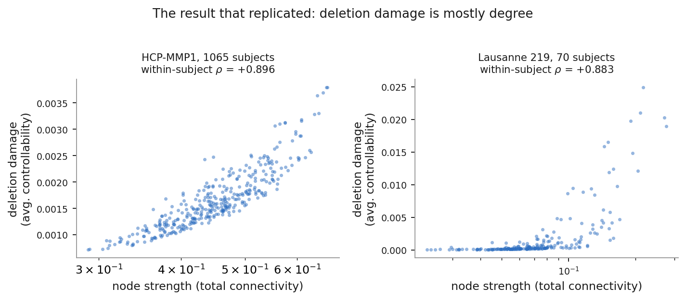
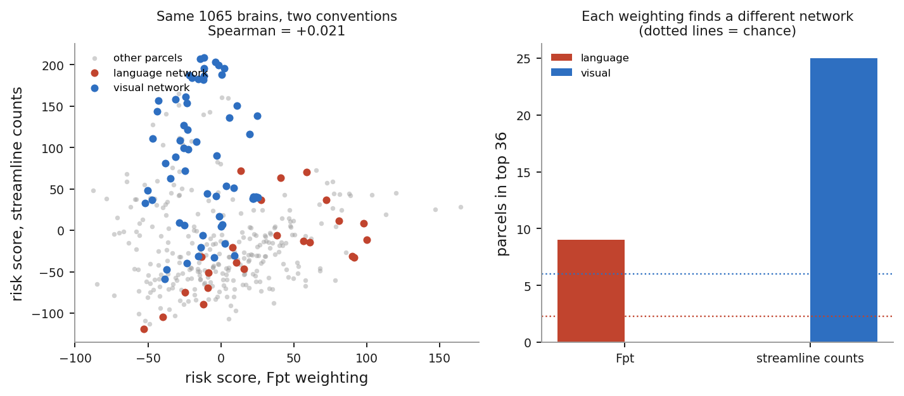
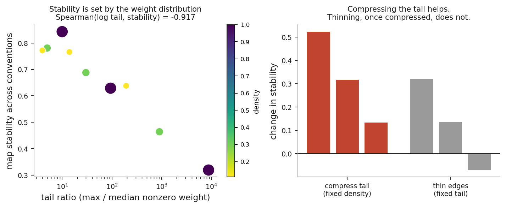
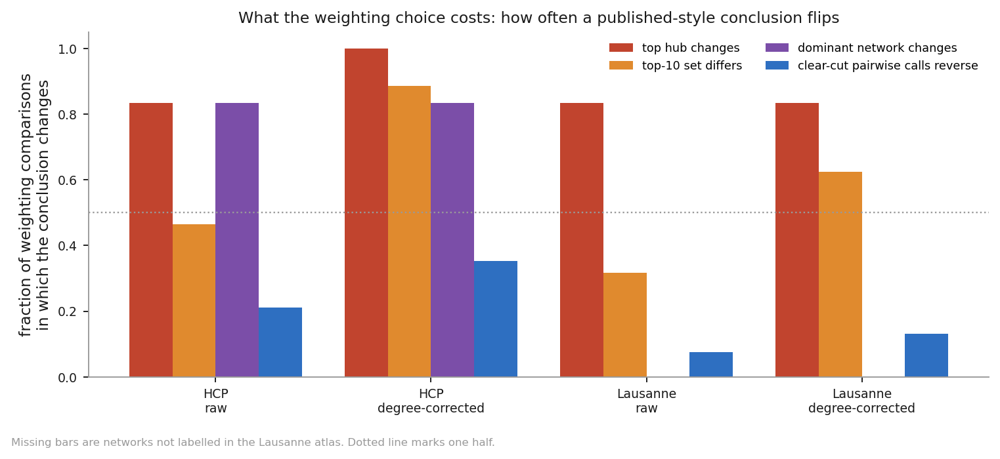

# Edge-weight distribution determines the conclusions of node-deletion analyses in structural connectomes

**Sujaal Gelle**

Independent researcher. Correspondence: gellesujaal@gmail.com
Code, data acquisition and verification: https://github.com/science182/nct-resection

---

## Abstract

Node-deletion analyses rank brain regions by how much their removal degrades a
network measure, and they are increasingly used to reason about which tissue can
be resected safely. Every such analysis rests on a choice of edge-weighting
convention, a decision that is usually reported in a single clause of the
methods. Here we asked how much of the final conclusion that choice determines.
Using 1065 Human Connectome Project subjects parcellated into 360 regions, we
found that deletion damage was largely a restatement of node degree (i.e., the
total connectivity of a region): average controllability tracked node strength
at rho = +0.896 within subject, and PageRank at +0.997. Once damage was
corrected for degree, the resulting maps were highly reproducible within a
weighting convention yet incompatible across conventions. Under fractional
probability weighting the corrected map concentrated on left perisylvian
language cortex, whereas under raw streamline counts, in the same brains, it
concentrated on ventromedial visual cortex; the two maps correlated at +0.021,
while each reproduced across independent halves of the cohort at +0.999. On a
factorial grid that separated the shape of the weight distribution from graph
density, stability tracked the heaviness of the distribution's tail
(rho = -0.917), and compressing that tail at full density raised stability from
+0.319 to +0.843. At the level of the conclusions a paper would actually report,
the cost was substantial: between the two native weightings, the ten
highest-risk parcels shared no members after degree correction, and comparable
instability appeared in standard centrality measures such as betweenness and
closeness. We therefore propose that the tail of the weight distribution be
treated as a diagnostic, that weights be compressed rather than thresholded, and
that conclusions, rather than map correlations, be reported. Two open-source
tools implement the diagnostic and a robustness-graded comparison of candidate
resections.

---

## 1. Introduction

Structural connectomes derived from diffusion tractography are increasingly used
to reason about surgical risk. A common design removes a region, or a contiguous
set of regions, recomputes a network measure, and ranks candidate resections by
the damage that follows1. Related work identifies hub regions through
centrality measures and argues that injury to them carries a disproportionate
cost2. The appeal of this approach is easy to see: if a network model
could anticipate which removals most disrupt brain-wide communication, it could
help inform where a surgeon operates.

Every such analysis, however, requires a prior decision about what an edge
weight means. Tractography can be summarized as a raw count of streamlines, as
the fraction of streamlines seeded from one region that reach another, as a
density normalized by region size and streamline length, or as a diffusion
scalar. These are distinct measurements rather than rescalings of one another,
and comparisons of weighting schemes have concluded that the choice shapes
interpretation without any single scheme being superior3.

In parallel, network control theory has been applied to connectomes. Average
controllability (i.e., the ease with which input to a region can drive the
network into nearby states) is known to correlate strongly with weighted
degree4, and a protocol paper for these methods names variability in
edge-weight distributions across preprocessing pipelines as a limitation,
although without quantifying it5.

We brought these two concerns together. We began from the working hypothesis
that controllability-based deletion damage carries information beyond degree.
The results did not support that hypothesis in the form we expected, and they
led instead to a second question. Our aim was not to show that weighting matters
in principle, which is already established, but to measure how much of a
specific and clinically framed conclusion it determines in practice, and to ask
whether that sensitivity can be predicted from a property of the data before any
analysis is run.

## 2. Methods

### 2.1 Data

Primary analyses used the connectomes released by Rosen and Halgren6,
comprising 1065 Human Connectome Project subjects parcellated with HCP-MMP1 into
360 cortical parcels and provided in two native weightings. Fpt denotes the
fraction of streamlines seeded from a parcel that reach a given target, whereas
the second file reports raw streamline counts directly. Before any paired
comparison, we verified that subject ordering was identical between the two
files.

Independent replication used 70 subjects from a Lausanne-atlas
release7 at scale 219. This dataset differs from the first in site,
acquisition, tractography pipeline, parcellation, edge-weight definition (fiber
density normalized by streamline length and region surface area) and graph
density (0.111 against 1.000).

### 2.2 Deletion design

Following Lin et al.1, parcels were removed and damage was scored over
the surviving parcels. For multi-parcel resections, anatomical contiguity was
defined by the true HCP-MMP1 adjacency, which we derived from the fsaverage
white-matter surface and the parcellation annotation files. This yielded 1050
parcel borders with a mean parcel degree of 5.83, consistent with a cortical
tessellation. Adjacency was block diagonal by hemisphere, since cortical tissue
is not contiguous across the midline and a resection therefore cannot grow from
one hemisphere into the other along the surface.

### 2.3 Network measures

Average and modal controllability were computed as described by Gu et
al.4, from the eigendecomposition of the adjacency matrix normalized
to a target spectral radius. Global efficiency was computed in its weighted
form, with edge weights inverted to distances, and PageRank and node strength
were computed in the standard way.

Two details of normalization materially affect lesion analyses, and each
produced a spurious result before it was identified. First, the intact and
lesioned networks must both be normalized by the spectral scale of the intact
network. If each network is instead normalized by its own largest singular
value, removing a hub lowers the denominator, inflates the controllability of
the lesioned network, and makes hub resection appear protective. Second, the
target spectral radius must suit the units of the weights. The conventional
additive form assumes streamline counts, and when it is applied to probability
weights it places the system in a regime where average and modal controllability
both linearize around the same quantity and become, in effect, redundant.

### 2.4 Degree correction

Removing a parcel removes exactly its own strength, so every raw damage measure
inherits degree by construction. We therefore defined a corrected score as the
residual of damage on within-subject strength rank. The results were invariant
to the form of this correction: linear, quadratic, cubic and rank-only fits
yielded identical network enrichment at p ~ 0.01, and a regression-free
comparison restricted to strength-matched pairs of parcels agreed.

### 2.5 Weighting conventions

To hold tractography fixed while varying only the convention, we derived four
weightings from a single matrix: raw, log10(1 + w), row-normalized, and
binarized at the top 30 percent of edges. Because these conventions are derived
rather than measured, we treated the comparison between the two native
weightings of the same subjects (Fpt against raw streamline counts) separately,
as the stronger test.

To separate the heaviness of the weight distribution from graph density, we
built base connectomes on a factorial grid before applying any convention.
Weights were raised to a power alpha in {1.0, 0.5, 0.25}, which compresses the
distribution without removing any edge, and this was crossed with thinning to
densities of {1.0, 0.30, 0.11}, which removes edges while leaving the surviving
weights untouched. We summarized tail heaviness as the tail ratio (i.e., the
maximum divided by the median nonzero off-diagonal weight).

### 2.6 Conclusion types

A map correlation does not by itself describe what a reader would conclude from
a map. We therefore scored the stability of five statement types, chosen to
match what is routinely reported: the identity of the top-ranked parcel, the
membership of the top ten, the full rank order (by Spearman correlation),
pairwise judgements of the form "removing A is worse than removing B", and the
network most over-represented among the highest-risk parcels.

Pairwise judgements were counted over clear-cut pairs only, defined as pairs
that the first map separates by more than half of its interquartile spread.
Reversing a near-tie is not a substantive disagreement, and counting all pairs
inflates the reported rate by roughly a third; both figures are reported in the
code output.

### 2.7 Spatial nulls

Network enrichment was tested against a spin null8, in which the map
was rotated 1000 times on the fsaverage sphere and parcels were matched to their
rotated positions with the Hungarian algorithm to produce genuine one-to-one
permutations. This procedure preserves the spatial autocorrelation of the map
and the geometry of the parcellation while destroying only the alignment between
map and anatomy. Free label shuffling is anti-conservative in this setting, and
indeed most secondary enrichments that reached significance under that null did
not survive the spin test.

## 3. Results

### 3.1 Deletion damage is largely a restatement of node degree

Across 1065 subjects, deletion damage measured by average controllability
correlated with node strength at rho = +0.896 (sd 0.018) within subject
(Figure 1). In the independent Lausanne dataset, despite a different pipeline
and parcellation, the same correlation was +0.883. PageRank correlated with
strength at +0.997, and global efficiency, the least degree-dependent of the
measures we examined, at +0.539. This relationship held for single-parcel and
for anatomically contiguous multi-parcel resections, both at group level and
within individual subjects.

The spatial correlation between average controllability and weighted degree has
been documented previously4. What we add is that the deletion delta
inherits this correlation more strongly than the nodal measure itself does
(+0.896 against +0.654). In retrospect this is expected, because removing a
parcel removes exactly its own strength, but it implies that a
controllability-based ranking of resections is, to a first approximation, a
ranking by how much connectivity each resection removes.

**Figure 1.** Deletion damage tracks node strength. Average-controllability
deletion damage against node strength for each parcel in the HCP-MMP1
connectomes (1065 subjects, left) and the independent Lausanne 219 connectomes
(70 subjects, right). Within-subject Spearman correlations are +0.896 and
+0.883. Horizontal axes are logarithmic.

### 3.2 Two native weightings of the same brains yield incompatible maps

Degree-corrected maps were highly reproducible within a convention. When the
cohort was split into independent halves of 532 and 533 subjects, the mean
corrected map of one half correlated with that of the other at +0.999.

Across the two native conventions, however, the corrected maps of the same
subjects correlated at only +0.021 (Figure 2). Under Fpt weighting, 9 of the 36
highest-risk parcels belonged to the language network, against 2.3 expected by
chance (spin test p = 0.005), and none belonged to the visual network. Under raw
streamline counts, 25 of the 36 belonged to the visual network, against 6.0
expected (p = 0.008), and none to the language network. Both enrichments survive
Bonferroni correction across ten networks. Since the two maps describe the same
brains, at most one of them can reflect anatomy.

Because the correlation with strength has been argued to be a spatial rather
than a between-subject property5, we tested both axes. The corrected
measure failed on each: spatial agreement between conventions was +0.021, and
between-subject agreement was +0.059, against a subject-shuffled null of -0.008,
with 149 of 360 parcels showing negative agreement. Node strength, by contrast,
was stable on both axes (+0.870 and +0.729).

**Figure 2.** Two native weightings of the same brains give incompatible
degree-corrected maps. Left: each parcel's degree-corrected risk score under
fractional probability (Fpt) weighting against raw streamline counts, 1065
subjects (Spearman +0.021). Language-network parcels are shown in red and
visual-network parcels in blue. Right: language and visual parcels among the 36
highest-risk parcels under each weighting. Dotted lines mark chance (2.3
language, 6.0 visual).

### 3.3 The tail of the weight distribution, not density, determines stability

On the factorial grid, map stability across conventions tracked the log tail
ratio at rho = -0.917 (Figure 3). Density tracked stability at only -0.211 and
contributed a partial correlation of +0.267 once the tail was known. Compressing
the tail at full density raised stability from +0.319 to +0.843, exceeding what
the sparser Lausanne connectomes achieve, whereas thinning edges at an
already-compressed tail changed stability by -0.070, that is, not at all. Cells
with matched tail ratios but very different densities agreed closely: a tail
ratio of 193 at density 0.11 gave +0.638, and a tail ratio of 94 at density 1.00
gave +0.629.

We note that an earlier analysis, which varied only density, appeared to
identify density as the cause. That sweep confounded the two factors, because
thresholding discards the smallest weights and thereby compresses the tail as a
side effect. The factorial design was introduced precisely to separate them.

**Figure 3.** Tail heaviness, not density, determines stability. Left: map
stability across weighting conventions against tail ratio (maximum over median
nonzero weight) for the nine cells of the factorial grid; colour and marker size
encode density. Right: change in stability from compressing the tail at fixed
density (red) and from thinning edges at fixed tail (grey).

### 3.4 What the choice of convention costs

Correlations understate the instability (Figure 4). For raw deletion damage
across the four derived conventions in HCP, the top-ranked parcel changed in 83
percent of comparisons, top-ten sets overlapped by 54 percent, clear-cut
pairwise judgements reversed 21.1 percent of the time, and the most
over-represented network changed in 83 percent of comparisons. All of this
occurred at a mean map correlation of +0.58. After degree correction, the
corresponding figures were 100 percent, 11 percent, 35.7 percent and 83 percent.

The contrast was sharpest between the two native weightings. For raw damage,
top-ten overlap was 43 percent and 29.6 percent of clear-cut judgements
reversed. After degree correction, the ten highest-risk parcels shared no
members at all, and 47.6 percent of clear-cut judgements reversed, a rate
indistinguishable from chance.

**Figure 4.** How often a published-style conclusion changes when only the edge
weighting changes. For each dataset and damage measure, the fraction of
comparisons between the four derived conventions in which the top-ranked parcel,
the top-ten set or the most over-represented network changes, and the fraction
of clear-cut pairwise judgements that reverse. The Lausanne atlas carries no
network labels, so dominant-network bars are absent there. The dotted line marks
one half.

### 3.5 The instability is not specific to control measures

To test whether this sensitivity is peculiar to network control theory, we
computed ten standard nodal centrality measures under each convention,
restricting the comparison to the three monotone conventions so that
binarization could not be said to drive the result, and averaging over four
subjects. Eight of the ten measures placed fewer than seven of their ten
highest-ranked parcels in common across conventions: PageRank 48 percent,
communicability 49 percent, strength 47 percent, eigenvector centrality 44
percent, betweenness 28 percent, average controllability 47 percent, modal
controllability 8 percent and closeness 14 percent. Mean rank correlations
ranged from +0.75 down to +0.33, and when the binary convention was included,
all ten measures fell below 70 percent in both datasets.

Betweenness, closeness and eigenvector centrality are not control-theoretic
measures; they are the standard instruments of hub identification, and they were
among the least stable in the panel. Binary degree served as an internal
validity check. Because it counts only which edges exist, it must be exactly
invariant under monotone reweighting, and it returned rho = +1.000 with complete
top-ten overlap. Weighted clustering was the only substantive measure that
remained stable under monotone reweighting (+0.958, 75 percent), and it
collapsed once binarization was admitted. The recurring pattern, in other words,
is high correlation with low overlap: a measure can preserve its bulk ordering
while exchanging most of the handful of regions that a paper would actually
name.

### 3.6 The convention displaces the map further than the subject does

All of the figures above were computed on cohort-average maps, whereas clinical
use is per patient. We therefore repeated the comparison within subjects and
added a between-subject control, in 16 subjects. For raw deletion damage under
monotone conventions, one subject's maps under two conventions agreed at
rho = +0.580, with 52 percent top-ten overlap, while the cohort-mean comparison
gave +0.572 and 54 percent. Contrary to our expectation, averaging therefore does
not materially inflate apparent stability. The weighting effect appears to be
systematic across subjects rather than a form of noise, and so it survives
averaging.

The between-subject control was more informative. Under a fixed convention,
maps from two different subjects agreed at rho = +0.839, with 65 percent overlap,
compared with +0.580 and 52 percent for a single subject across conventions.
After degree correction the contrast widened: +0.706 and 38 percent between
subjects, against +0.312 and 8 percent within a subject across conventions. In
other words, changing the analytic convention displaced the map further than
changing the brain did. For applications that present per-patient maps, this
suggests that part of the apparent individual specificity may be attributable to
the pipeline rather than to the patient.

We note that this juxtaposes a within-subject, cross-convention correlation with
a between-subject, same-convention one. These are distinct quantities, and the
comparison is not an identity, in the same sense that test-retest reliability
and between-group difference are distinct.

### 3.7 Replication in an independent dataset

In the Lausanne connectomes the degree result replicated (+0.883), but the
instability did not replicate at the same magnitude: degree-corrected map
stability across conventions was +0.756, against +0.289 in HCP. This difference
is consistent with the proposed mechanism, since the Lausanne matrices have a
tail ratio near 190, compared with roughly 10,000 for raw HCP streamline counts.
Conclusion-level instability was correspondingly lower but not negligible: the
top hub changed in 83 percent of comparisons, top-ten overlap was 68 percent, and
7.6 percent of clear-cut judgements reversed.

### 3.8 Measures that did not work

We also examined minimum control energy, as a candidate measure that is not
simply a spectral summary of the matrix. With full control, the network barely
entered the result: the effect of a deletion was under 0.01 percent of the
intact energy, and its sign contradicted the model in 66 percent of cases.
Restricting the set of driver nodes made the network matter, but left the
Gramian near-singular, with energies of order 1e12 and sign violations in close
to half of cases. We believe a usable formulation would require reachable target
states derived from measured activation, together with a regularized objective.

Modal controllability was less dependent on degree (-0.483), but at any
normalization where lesion deltas were well conditioned it behaved as a near
relabeling of average controllability, and so it did not provide independent
evidence.

## 4. Discussion

### 4.1 What is and is not new

Several of our findings replicate what is already known. The correlation between
controllability and degree is documented4, the influence of weighting
on graph metrics is established3, log-transforming skewed connectome
weights is common practice, and multiverse analysis (i.e., systematically
repeating an analysis across defensible choices) is a recognized methodology.

There is also a standing counter-argument that deserves a direct answer. Parkes
et al.5 argue that the correlation with strength is spatial rather
than between-subject, and that average controllability outperforms strength in
out-of-sample prediction of clinical variables. Our analyses are primarily
spatial, which is the axis on which the correlation is conceded. We did not test
prediction of an external variable, and our results therefore do not contradict
theirs. They do suggest, however, that this defence does not extend to the
deletion setting, since the corrected measure was unstable on the between-subject
axis as well.

What appears not to have been quantified before is the combination reported
here: the tail ratio as a predictor of when weighting determines the answer,
applied to control measures, in the deletion setting, and expressed as the rate
at which reported conclusions change rather than as map correlations.

### 4.2 Recommendations

Our results suggest four practical recommendations. First, weights should be
transformed rather than thresholded. Raw streamline counts have tail ratios near
10,000; raising weights to approximately the 0.35 power, or applying a log
transform where counts are large, brings the ratio below 30 and lifts stability
from +0.32 to +0.84 while retaining every edge. Thresholding to 11 percent
density, by comparison, reaches only +0.64 and discards 89 percent of the graph.

Second, node strength should be reported alongside any network measure, because
where a finding correlates with strength above roughly 0.9, the simpler quantity
would have produced it.

Third, a map correlation should not be reported as evidence that conclusions are
stable. In our data, a correlation of +0.58 coexisted with the top hub and the
dominant network each changing in five comparisons out of six.

Fourth, specific comparisons between candidate resections can be graded for
robustness rather than reported as point estimates. When we scored comparisons
across conventions and measures, clearly separated candidates gave 5 of 6 robust
comparisons and no coin flips, whereas candidates matched on total connectivity
removed gave 1 robust comparison and 1 coin flip. An unstable whole-brain map, in
other words, does not by itself make every specific comparison unreliable, and
distinguishing the two cases is tractable.

### 4.3 Limitations

This work has several limitations. It rests on two datasets, one of only 70
subjects, and because the Lausanne release ships a single native weighting, its
four conventions are derived, so the native two-weighting comparison exists only
in HCP. The factorial grid used 8 subjects per cell across 9 cells, and the
density sweep 10 to 12 per condition; these samples are adequate to estimate a
map correlation but not to place a tight interval on it. Global efficiency was
computed with our own implementation rather than that of the original authors,
so comparative statements about it should be read as a flag rather than a
result.

Most importantly, we had no outcome data. Whether any of these maps predicts
post-operative deficit is the question that matters clinically, and it cannot be
answered from public connectomes; it requires resection extent together with
domain-specific neuropsychological outcomes. The present work establishes that
the maps disagree with one another, not which of them, if any, is correct.
Future studies that pair pre-operative connectomes with post-operative outcomes,
analyzed under more than one weighting convention, are warranted to determine
whether any deletion-based map carries clinically useful information.

## 5. Data and code availability

All inputs are public. The script `download_data.py` retrieves them from Zenodo
and TemplateFlow, and `reproduce.py` recomputes every numerical claim in this
manuscript, compares each against the reported value, and exits with an error on
any mismatch; at the time of writing, 22 of 22 pass. Two command-line tools,
`audit.py` and `resection_report.py` (installable as `nct-audit` and
`nct-resection-report`), implement the diagnostic and the graded comparison.
Code is available at https://github.com/science182/nct-resection.

## References

1. Lin YH, Dadario NB, Tang SJ, et al. Discernible interindividual patterns of global efficiency decline during theoretical brain surgery. Sci Rep. 2024;14:14573.
2. Yeung JT, Taylor HM, Young IM, Nicholas PJ, Doyen S, Sughrue ME. Unexpected hubness: a proof-of-concept study of the human connectome using PageRank centrality and implications for intracerebral neurosurgery. J Neurooncol. 2021;151(2):249-256.
3. Weighting the structural connectome: exploring its impact on network properties and predicting cognitive performance in the human brain. Netw Neurosci. 2024;8(1):119-137.
4. Gu S, Pasqualetti F, Cieslak M, et al. Controllability of structural brain networks. Nat Commun. 2015;6:8414.
5. Parkes L, Kim JZ, Stiso J, et al. A network control theory pipeline for studying the dynamics of the structural connectome. Nat Protoc. 2024;19(12).
6. Rosen BQ, Halgren E. A whole-cortex probabilistic diffusion tractography connectome. eNeuro. 2021;8(1):ENEURO.0416-20.2020.
7. Structural and functional connectome of 70 healthy adults, Lausanne atlas. Zenodo 2872624.
8. Alexander-Bloch AF, Shou H, Liu S, et al. On testing for spatial correspondence between maps of human brain structure and function. NeuroImage. 2018;178:540-551.
