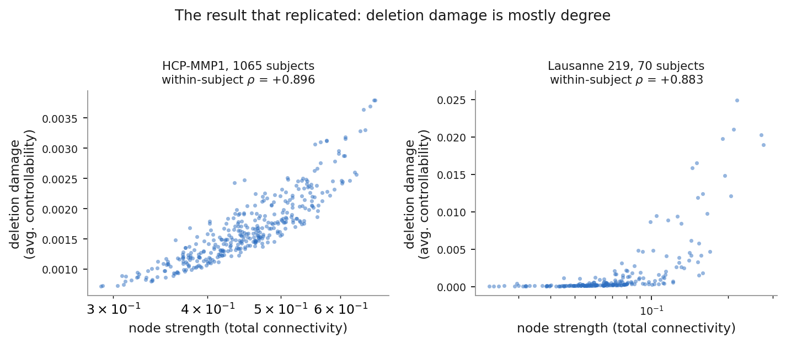
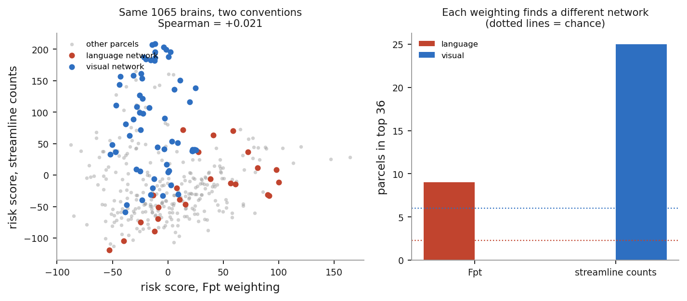
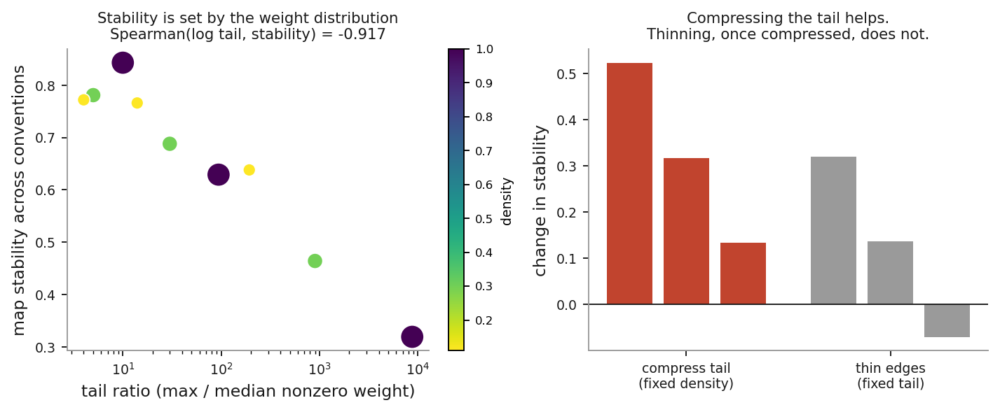
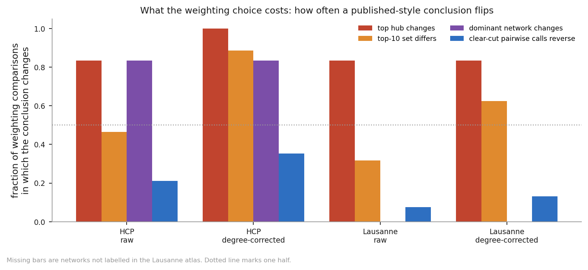

# nct-resection

**Short standalone write-up: [FINDINGS.md](FINDINGS.md).** The rest of this file
is the working record, including everything that failed.

Does ranking simulated brain resections by network controllability tell a
surgeon anything that global efficiency and node degree do not already say?

Tested on the Rosen & Halgren HCP-MMP1 connectomes, 360 parcels, up to 1065
subjects, using the contiguous deletion design from Lin et al. 2024
(Sci Rep 14:14573).

## The answer is no, and here is the short version

**Controllability is mostly degree.** As a resection score, average
controllability tracks node strength at +0.892 within subject, which you can
get by summing a row of the connectivity matrix. This holds on the group
average and per subject, for single parcels and for anatomically contiguous
multi-parcel resections. PageRank is worse, +0.997.

**Correcting for degree does not rescue it.** The corrected map looked
promising, concentrating on left perisylvian language cortex, 8 of the top 36
parcels against 2.3 expected, surviving a spin test at p = 0.011. It does not
replicate. Rerun on raw streamline counts, the weighting Lin et al. actually
used, the same analysis gives 0 of 36 for language and flags ventromedial
visual cortex instead, 25 of 36. The two maps are uncorrelated, -0.008, while
each is internally reproducible above +0.97.

**The cause.** Enrichment appears only when the edge-weight distribution is
heavy-tailed. Under log or binary weighting both damage measures become
almost perfectly degree (r > 0.99), leaving no non-degree component to test,
and nothing is enriched at all. The finding is a property of the weighting
convention, not of anatomy.

**Where the instability is, corrected.** Raw global efficiency and raw
controllability correlate better across conventions (+0.58 and +0.57) than
degree-corrected maps (+0.04 and +0.29), and an earlier version of this file
read that as raw pipelines being safe. Counting conclusions rather than
correlations shows otherwise: even for raw deletion damage the top hub changes
in 83 percent of weighting comparisons, top-10 sets overlap only 54 percent, and
the most over-represented network changes in 83 percent. Degree correction makes
this worse rather than causing it. See `run_fliprate.py`.

**Control energy** was the remaining candidate and does not work as formulated:
no sensitivity with full control, an ill-conditioned Gramian with restricted
control, and sign violations in 44 to 66 percent of cases either way.

Nine separate results in this project looked clean and significant and were
wrong. Each is documented below with the control that caught it. That record is
the main thing worth taking from this repo.

## The argument in four figures

`python3 figures.py` regenerates these from the cached results.

**1. What replicated.** Deletion damage tracks node strength in both datasets,
+0.896 across 1065 HCP subjects and +0.883 in a different site, pipeline and
parcellation. As a resection score it is largely reproducible by summing a row
of the connectivity matrix.



**2. What did not.** The same 1065 brains under two standard edge weightings
give risk maps that are uncorrelated (+0.021), and each flags a different
network. Language parcels sit high under Fpt and unremarkable under streamline
counts; visual parcels do the reverse. Each map on its own is reproducible
across independent halves at +0.999.



**3. Why, and what to do.** Stability is set by how heavy-tailed the edge weight
distribution is, not by density. Note the colouring in the left panel: dense
connectomes appear at both the top and the bottom, so density does not order the
points. Compressing the tail at fixed density helps a great deal; thinning edges
once the tail is already compressed does nothing.



**4. What it costs.** Taking the kinds of statement papers actually make and
counting how often each changes when only the weighting changes. Even for raw
deletion damage, the measure as usually reported, the top hub changes in 83
percent of comparisons and the most over-represented network changes just as
often. Degree correction makes it worse. Note that this happens at a map
correlation of +0.58, which is why reporting correlation in place of the
conclusion understates how much is contingent.



## What is new here, and what is not

Most of this replicates known results. Being clear about that up front:

**Not new.** Average controllability tracks node strength. Gu et al. (2015)
report r = 0.91; the +0.896 measured here reproduces it. That edge weighting
changes graph metrics is also well established, with its own reproducibility
literature. Multiverse analysis is an established methodology, including in
network neuroscience via the Comet toolbox.

**A rebuttal this project has to answer.** Parkes et al. argue the
strength correlation is *spatial*, across the brain, and does not imply
redundancy *between subjects*: average controllability outperformed strength at
out-of-sample prediction of psychosis symptoms. Every analysis here is spatial,
which is exactly the axis where the correlation is conceded to be high. The
reply is that for a surgical planning map the spatial axis is the relevant one,
since a surgeon chooses a location rather than a patient, but that argument has
to be made rather than assumed. Nothing here contradicts the between-subject
case for controllability.

**What does appear to be untested.** The network control theory protocol paper
names this exact concern as a limitation without measuring it: "the distribution
of edge weights can vary significantly across different pre-processing
pipelines, which implies equally significant variations in the strength of
interactions between regions." The Comet toolbox, which exists to run multiverse
analyses in network neuroscience, does not include controllability measures and
targets functional rather than structural connectivity. Virtual resection with
control measures exists (Khambhati et al. 2016 on synchronizability, Janson et
al. 2024 on controllability after temporal lobe resection), but without
weighting-sensitivity analysis.

So the contribution is narrow and specific: a quantitative demonstration of a
stated but untested limitation, in the lesion and resection setting that
existing multiverse tooling does not cover. Two conventions, mutually exclusive
enrichments, each surviving a spin test and Bonferroni correction and each
reproducing at +0.999 across independent halves. That is confirmation with
numbers attached, not a discovery, and it should be described that way.

**Testing the rebuttal directly** (`run_axes.py`). Both weightings run on the
same 1065 subjects in verified identical order, compared along both axes:

    agreement between Fpt and streamline    spatial   between-subject
      raw damage (d_ac)                      +0.394       +0.451
      degree-corrected damage                +0.021       +0.059
      node strength                          +0.870       +0.729
      subject-shuffled null                                -0.008 (sd 0.031)

Both axes collapse for the degree-corrected measure. Between-subject agreement
of +0.059 sits barely above a shuffled null and is not even consistent in sign:
149 of 360 parcels are negative, sd 0.310, spanning -0.765 to +0.799.

Node strength, by contrast, is stable on both axes, and raw damage is moderately
stable. The pattern is coherent: the degree component of resection damage
survives a change of convention and everything beyond degree does not, whichever
way the data is sliced. The only dependable signal in these measures is the one
that does not require controllability to compute.

The limit of this test: Parkes et al.'s claim was that average controllability
*predicts* an external variable between subjects better than strength does.
That is not what is measured here, which is whether the values themselves
survive a change of weighting. The two are different claims and this one does
not refute theirs. It does show that their defence does not rescue this
application, and it suggests that any surviving between-subject signal would
have to ride on the degree component, which is the part that stays stable.

## Independent replication: the degree result holds, the weighting result does not

Everything above uses one dataset, which makes it a statement about one
tractography pipeline. `run_lausanne.py` repeats the core tests in a second
dataset that differs on every axis: 70 subjects rather than 1065, a different
site and acquisition, Connectome Mapper rather than probtrackx, the Lausanne 219
atlas rather than HCP-MMP1 360, fiber density rather than fractional probability
as the edge weight, and 11 percent density rather than fully dense
(Zenodo 2872624, CC-BY 4.0).

    measure                              HCP        Lausanne 219
    d_ac vs strength, within subject    +0.896        +0.883      replicates
    degree-corrected map stability      +0.289        +0.756      does NOT
    node strength map stability         +0.748        +0.834

**The degree confound replicates cleanly.** Controllability damage tracks node
strength at +0.883 here against +0.896 in HCP, in a completely different
pipeline and parcellation. That is the robust finding in this project, and it is
also the finding that was already known.

**The weighting instability does not replicate.** In the Lausanne connectomes
the degree-corrected map is reasonably stable across the four conventions,
+0.756, where in HCP it collapsed to +0.289. So the headline claim above is not
a general property of network control measures. It is at least partly a property
of the connectomes it was measured on.

The obvious candidate is the structural difference between the two datasets. HCP
probtrackx output is fully dense with edge weights spanning about 250,000 to 1,
while the Lausanne matrices are 11 percent dense spanning about 20,000 to 1.

**Correction: it is the weight distribution, not density** (`run_mechanism.py`).
The density sweep below was confounded. Thresholding removes edges *and*
discards the smallest weights, so every point in it moved both knobs at once.
Separating them on a grid, by raising weights to a power alpha (which compresses
the tail without removing any edge) and thinning independently:

    alpha  density   tail max/median   map stability
     1.00    1.00         8748            +0.319
     1.00    0.30          899            +0.464
     1.00    0.11          193            +0.638
     0.50    1.00           94            +0.629
     0.50    0.30           30            +0.688
     0.50    0.11           14            +0.766
     0.25    1.00           10            +0.843
     0.25    0.30            5            +0.781
     0.25    0.11            4            +0.772

    compressing the tail at fixed density   +0.523, +0.317, +0.134
    thinning at fixed tail                  +0.319, +0.136, -0.070

    Spearman(log tail ratio, stability)     -0.917
    Spearman(density, stability)            -0.211
    partial(density, stability | log tail)  +0.267

Tail heaviness accounts for nearly all of it. Compressing the tail at full
density lifts stability from +0.319 to +0.843, better than the Lausanne dataset
manages. Thinning at an already-compressed tail does nothing (-0.070). Cells
with matched tail ratios but very different densities land in the same place:
tail 193 at density 0.11 gives +0.638, tail 94 at density 1.00 gives +0.629.

**This changes the recommendation.** Thresholding is not the fix, it is a side
effect that happens to compress the tail while throwing away 89 percent of the
edges to get there. Compressing the weight distribution directly, by a log or
power transform, keeps every edge and produces a more stable map than
thresholding does. If you are running control measures on a dense probabilistic
connectome, transform the weights rather than thinning the graph.

The density sweep is kept below for the record, and because it is what motivated
the grid, but its causal reading was wrong.

**Density sweep, superseded** (`run_density.py`). Thinning the HCP connectomes
toward Lausanne's density recovers most of the stability, monotonically:

    HCP edges kept    density    degree-corrected map stability
      100%             1.00              +0.261
       50%             0.50              +0.262
       30%             0.30              +0.409
       11%             0.11              +0.594
    Lausanne 219       0.11              +0.756

Read at the time as density being the cause. The grid above shows that reading
was wrong: thinning helps only because it compresses the weight distribution on
the way. The residual gap between +0.594 and +0.756 is presumably the other
pipeline differences: parcellation, tractography algorithm, and edge-weight
definition.

The claim that survives is narrower and more useful than the original, because
it comes with a condition and a remedy. On a connectome with a very heavy edge
weight distribution, the degree-corrected resection map depends heavily on the
weighting convention. Compressing that distribution largely removes the
dependence.

It also lands squarely on the design being replicated here: Lin et al. state
their matrices were "not binarized or thresholded", which is the regime where
this problem is worst. That is a concrete, checkable methodological caution
rather than a general complaint about network control theory.

Caveat: the density sweep used 12 subjects per condition, enough to estimate a
map correlation but not a precise one.

One caveat on the comparison: the Lausanne release ships a single native
weighting, so all four conventions there are derived from it. The HCP figure
used for comparison (+0.289) is the matching derived-weighting number, not the
Fpt-against-streamline-counts comparison, so this is like for like. The native
two-weighting test could not be run in the second dataset.

## Running it

```bash
pip install -r requirements.txt
python3 download_data.py          # core inputs, ~13 MB
python3 test_nct.py               # 16 checks, ~10s
python3 test_audit.py             # 22 checks on the audit tool, ~20s
python3 demo.py                   # end-to-end on a synthetic graph, ~1 min
python3 run_real.py               # group-average sweep, ~2 min
```

## Checking the numbers in this file

Every headline figure quoted here is recomputed and compared against the written
value by one command:

```bash
python3 reproduce.py
```

It reports each claim as pass, fail, or skip, and exits non-zero on any failure,
so it can gate a commit. Claims needing the large sweeps are skipped rather than
failed when those files are absent. At the time of writing, 12 of 12 pass.

## Comparing candidate resections

`resection_report.py` is aimed at the question a planning pipeline actually
faces, which is not "how risky is this parcel" but "is corridor A safer than
corridor B". That comparison can hold up even when the underlying map does not.

```bash
python3 resection_report.py --input conn.mat --grow 5 --seeds 12,45,88
python3 resection_report.py --input conn.mat --candidates 12,13|45,46 --json out.json
```

For each pair of candidates it reports how consistently one beats the other
across 4 weighting conventions crossed with 3 damage measures, and grades it:

    ROBUST      the same winner under every choice
    LIKELY      one winner in at least four fifths of choices
    COIN FLIP   the answer is set by the analysis, not the anatomy

Plain node strength is one of the three measures on purpose. If it agrees with
the others, the report says so, because then total connectivity removed would
have told you the same thing.

Measured on HCP streamline connectomes, it discriminates in both directions:
clearly different corridors give 5 of 6 robust comparisons and no coin flips,
while corridors matched on total connectivity removed give 1 robust and 1 coin
flip. So an unstable whole-brain map does not by itself make specific surgical
comparisons unreliable, which is the useful thing to be able to check.

`--json` writes the full result, including per-candidate damage under every
choice, for wiring into an existing pipeline.

## Auditing your own connectomes

`audit.py` is the practical output of all this. Point it at a connectome and it
reports whether a deletion-based map from that data can be trusted, and what to
do if not.

```bash
python3 audit.py --input yourdata.mat
python3 audit.py --input data/averageConnectivity_Fpt.csv --log10
```

It answers three questions about your dataset rather than about the method:

1. **How much of the deletion damage is just node strength?** If the ranking is
   degree, summing a row of the matrix reproduces it and the fancier measure
   earns nothing.
2. **Does the map survive a change of weighting convention?** Measured directly
   by rebuilding it under four conventions and correlating the results.
3. **What fixes it?** Solved for your data, not assumed. It checks whether a log
   transform actually compresses your weights, and if not, finds the power
   transform that does.

On the two datasets here it discriminates as it should: HCP streamline counts
come back at +0.204 ("a map from any single weighting is not trustworthy on its
own"), and the Lausanne connectomes at +0.669 ("report results under more than
one"). For HCP it recommends `w ** 0.35`, which keeps all 129,240 edges, over
thresholding, which would discard 89 percent of them to achieve less.

Accepts `.npy`, `.csv`, and MATLAB `.mat` including nested structs and
multi-scale releases. `--max-nodes` picks which parcellation scale to audit when
a file holds several.

For the per-subject and weighting analyses, fetch the large inputs first:

```bash
python3 download_data.py --full   # adds 1.3 GB of per-subject connectomes
```

No data is committed to this repo. `download_data.py` pulls everything from
Zenodo and TemplateFlow; the connectomes are Rosen & Halgren, CC-BY 4.0.

Runtimes worth knowing: `run_subject_deletions.py` is about 2 minutes per
subject, and `run_weightings.py` about 7, since each does 360 deletions per
subject per weighting. Both checkpoint after every subject and resume.

## Files

- `controllability.py` — average and modal controllability following
  Gu et al. (2015). `delta_controllability` is the lesion-aware wrapper.
- `energy.py` — minimum control energy for a state transition, and how much a
  resection raises it. Also `apply_resection`, which is where the
  disconnect-vs-delete choice lives.
- `lesion.py` — contiguous resection growth, weighted global efficiency,
  PageRank.
- `compare.py` — ranks resections by every metric and extracts the
  disagreement set. This is the actual output.
- `data.py` — real connectome sources and loading/validation.
- `annot.py` — FreeSurfer .annot and GIFTI readers, and the real HCP-MMP1
  parcel adjacency built from the fsaverage surface.
- `demo.py` — synthetic connectome, end-to-end run.
- `test_nct.py` — 16 checks, no pytest needed.

Analyses, roughly in the order they should be read:

- `run_real.py` — single-parcel sweep on the group average, with the node
  strength redundancy check that reframed the project.
- `run_multiparcel.py` — contiguous multi-parcel resections using real adjacency.
- `run_energy.py` — control energy against the degree baseline.
- `run_subjects.py`, `run_connectotype.py` — per-subject nodal profiles and
  individual variation.
- `run_subject_deletions.py` — per-subject deletion sweeps (9.4 h for 24).
- `run_position.py` — the degree-corrected score, and the tests that make it
  believable.
- `spin_test.py` — spatial autocorrelation null. Run this before believing any
  enrichment result.
- `run_confounds.py` — parcel geometry and degree-correction robustness.

## First real result: average controllability is mostly node strength

Single-parcel deletion sweep over all 360 parcels of the Rosen & Halgren group
average, unthresholded to match Lin et al. 2024, whose methods state the
matrices were "not binarized or thresholded" (`run_real.py`, ~2 min).

The headline comparison looks encouraging: Spearman(d_ave_control,
d_global_eff) = +0.529, with 19 of 36 parcels in each metric's worst decile
missed by the other. That is exactly the disagreement the project is looking
for.

It does not survive the obvious control. Gu et al. (2015) noted average
controllability tracks weighted degree, so node strength is the baseline any
claim here has to beat:

    measure            vs strength    partial vs d_global_eff | strength
    d_ave_control        +0.903            +0.077
    d_mod_control        -0.483            -0.259
    d_global_eff         +0.555             --
    pagerank             +0.997            -0.195

(These are the values the shipped code reproduces at the default normalization
radius of 0.95. An earlier draft of this file quoted +0.909 and +0.158, computed
before the default was changed away from 0.9999 for the reason given under the
Units trap below. The conclusion is unchanged.)

Average controllability's resection ranking is 90 percent explained by summing
a row of the connectivity matrix, and once strength is partialled out its
relationship to global efficiency damage falls from +0.529 to +0.077. Worse,
the parcels it flags that global efficiency misses have a median strength rank
of 29 out of 360, against 116 for the parcels global efficiency flags alone. So
"controllability finds what efficiency misses" is, at this level, "controllability
finds high-degree nodes."

**The rescue hypothesis, tested and failed.** Node strength is additive over a
resected set; controllability is not. So multi-parcel resections were the one
principled reason to expect average controllability to escape degree. It does
not. Using real HCP-MMP1 surface adjacency to grow anatomically contiguous
resections, Spearman(d_ave_control, total strength removed) by resection size:

    radius    size 1    size 8
    0.90      +0.774    +0.769
    0.95      +0.849    +0.799
    0.99      +0.870    +0.707

Average controllability stays a degree proxy at every well-conditioned
normalization and every resection size tested.

At radius 0.9999 the size-8 correlation appears to flip to -0.883, which looks
like a dramatic escape and is not one. There the lesion delta is 98 percent
constant offset (see the Units trap below), so the rank correlation is computed
on a 2 percent residual and its sign is meaningless. This was the third
confident, clean, spurious result this project produced.

**Modal controllability** is less degree-correlated (-0.23 to -0.50) but at any
radius where lesion deltas are usable it is close to a relabeling of average
controllability, so it is not independent evidence.

**Control energy: tested, does not work as formulated.** This was the one
remaining quantity that is not a spectral summary of the matrix. Targets were
bilateral activation of each of the ten networks, from a zero initial state,
horizon 10, resections applied by disconnecting.

The first pass looked like a success: extra energy correlated with strength at
only +0.179 against average controllability's +0.903, and the rankings were
target-specific (median cross-network rank agreement +0.075), which is exactly
the per-function risk score the project wants. It was noise.

    B                intact energy    negative extras    |extra| / intact
    identity              22.9              66%              8.7e-05
    40 drivers          4.3e+12             58%              1.2e-01
    10 drivers          1.6e+12             44%              9.9e-02

Two independent disqualifiers. Removing tissue lowered the energy in the
majority of cases, which contradicts the model: with B = I the Gramian can only
shrink when connectivity is removed, so energy must rise. And the effect was
under 0.01 percent of the intact energy, computed through a least-squares solve
on an ill-conditioned Gramian, so the rank correlations were noise.

Restricting the driver set makes the network matter, but the target state is
then effectively unreachable in the horizon, the Gramian goes near-singular, and
energies reach 1e12. Sign violations persist either way.

To make this a real test it needs reachable target states, most likely derived
from measured activation patterns rather than binary network masks, a longer
horizon, or a regularized optimal-control formulation with a state-tracking cost
rather than pure minimum energy. Those are all real options. None of them are
tested here.

That matters for the motivating gap. PageRank correlates with strength at
+0.997 on this matrix, so the finding in Lin et al. that PageRank predicts the
worst deletion only 35 to 75 percent of the time is close to a statement that
*degree* predicts it 35 to 75 percent of the time. The unexplained residual is
by construction where degree fails, which makes a degree-orthogonal measure the
natural candidate for it, and average controllability specifically the wrong one.

Caveats that keep this preliminary: group average rather than per subject,
single-parcel rather than contiguous multi-parcel, one dataset, and Fpt
probability weights rather than the streamline counts Lin et al. used.

One clean mathematical result also fell out: modal controllability's *ranking*
is exactly invariant to normalization scale, since MC_i = 1 - a^2 * sum_j
lam_j^2 U_ij^2 and a^2 is common across nodes. Its Spearman values are identical
across every normalization tested, which is correct behavior, not a bug.

Threshold robustness is a real open issue rather than the headline: the
d_ave_control correlation falls to +0.427 keeping the top 15 percent of edges
and +0.074 (n.s.) at the top 5 percent.

Parcel indices are positional into the 360-row matrix, not yet mapped to
anatomical labels, so no region can be named from them.

## Per-subject: the first positive result

Everything above is a group average, which by construction cannot address the
finding in Lin et al. 2024 that the most damaging parcel differs between
individuals. Running nodal controllability across all 1065 individual
connectomes (`run_subjects.py`, then `run_connectotype.py`) gives the first
result in this project that survives its own controls.

    within-subject Spearman(nodal AC, strength)   +0.654  (sd 0.024)
    variance in AC explained by strength           25.7%
    residual still encoding strength (max |rho|)    0.089   -> clean
    subject-similarity agreement, AC vs strength   +0.384
    residual structure vs parcel-shuffled null      2.17x   -> structured

Average controllability carries subject-specific information that node strength
does not. The residual after removing strength is not noise, it does not
secretly re-encode degree, and controllability's account of which subjects
resemble each other differs substantially from strength's.

Connectotype diversity is the sharpest version. Counting how many distinct
parcels take the top rank across 1065 subjects:

    average controllability     12 distinct, modal parcel holds 28.5%
    strength                    23 distinct, modal parcel holds 36.7%
    AC residual                159 distinct, modal parcel holds  6.9%

Raw controllability is *less* individually variable than strength. It is the
strength-removed residual that is highly individual.

**What this does not show.** The dataset has one connectome per subject, so
there is no test-retest split and no way to separate stable individual biology
from subject-specific tractography artifact. A spatially structured artifact
would reproduce every number above. The parcel-shuffle null in test C only rules
out unstructured noise, not systematic artifact, and it is a weak null for that
reason. This is evidence that the residual is real signal about *something*, not
evidence that it is neuroanatomy.

**And it does not transfer to resection damage.** Per-subject deletion sweeps
over 24 individual connectomes (`run_subject_deletions.py`, 9.4 hours):

    within-subject Spearman(d_ac, strength)   +0.892  (sd 0.020)
    within-subject Spearman(d_ac, d_ge)       +0.493  (sd 0.045)
    d_ac vs own-subject d_ge                  +0.4928
    d_ac vs other-subject d_ge                +0.4536
    individual-specific gain                  +0.0393

    worst parcel across 24 subjects:
      d_ave_control    4 distinct winners
      d_global_eff     5 distinct winners
      strength         5 distinct winners

Individual data does not rescue the resection claim. Deletion-delta
controllability tracks strength at +0.892 within subject, essentially unchanged
from +0.903 on the group average. It produces no more individual variation in
which parcel is worst than global efficiency or degree do. The
individual-specific component is +0.039, which is negligible.

Note the contrast that explains the whole project: nodal controllability tracks
strength at +0.654 and has a genuinely individual residual, while the deletion
delta built from it tracks strength at +0.892. The connectotype result above is
real and is about nodal controllability. It does not carry over to resection
damage, which is the quantity that would matter clinically.

**An invalid test, recorded so it is not repeated.** The first version of this
analysis split parcels into halves and correlated a subject's profile on half A
against profiles on half B, calling it fingerprinting. Those vectors are indexed
by different parcels and have no reason to align even within a subject. It
returned chance accuracy for every input including node strength, which is what
exposed it, since strength profiles are reliably identifiable in the literature.
Genuine fingerprinting needs two sessions per subject, which this data does not
have. Keep a known-positive control in any test of this kind.

## At full scale (n = 1065): the artifact is robust, which is worse

The per-subject results below were computed on 24 subjects because the sweep
cost 9.4 hours. `run_scale.py` reduced that by about 90x, so the same analysis
now runs on all 1065 subjects (6.2 hours, results identical to 2.75e-12 against
the original run). Scaling up did not weaken the language finding. It
strengthened it:

    within-subject Spearman(d_ac, strength)   +0.896  sd 0.018   (was +0.892)
    within-subject Spearman(d_ge, strength)   +0.539  sd 0.029
    Language in top 36                        9, spin p = 0.0050  (was 8, p = 0.011)

    independent split, 532 vs 533 subjects
      half A   Language 9/36, spin p = 0.0050
      half B   Language 9/36, spin p = 0.0050
      map agreement between halves        +0.999

So the language map now clears Bonferroni across ten networks and replicates
exactly across two independent halves of more than 500 subjects each. It is
still an artifact of the edge weighting, because streamline weighting gives 0
of 36 and visual cortex instead.

That combination is the real lesson of this repository. The failure mode is not
an underpowered fluke that more data washes away. It is a highly reproducible,
statistically robust, anatomically plausible result that is nonetheless
determined by a preprocessing convention. More subjects make it look more
convincing, not less.

**The contradiction at full scale.** Both weightings run on all 1065 subjects,
from the same tractography, differing only in convention:

                            Fpt              raw streamline counts
    Language            9/36  p = 0.0050      0/36  p = 1.00
    Visual              0/36  p = 1.00       25/36  p = 0.0080
    split-half agreement       +0.999               +0.999
    d_ac vs strength           +0.896               +0.689

    agreement between the two degree-corrected maps:  +0.021

Each map is essentially perfectly reproducible across independent halves of
more than 500 subjects. Each produces an enrichment that survives a spin test
and Bonferroni correction. They are orthogonal to each other, and they are
mutually exclusive: the weighting that finds language finds no visual effect at
all, and the weighting that finds visual finds no language effect at all.

Neither is underpowered. Neither is a fluke. Both are wrong, or at least neither
can be believed on its own, and no amount of the usual rigour distinguishes
them. Only changing the edge weighting exposes it, and edge weighting is a
choice that most papers report in a single clause of the methods section.

## The language result does not replicate across weightings

The section below describes a degree-corrected controllability score that
concentrates on language cortex. It survived a spin test, four different degree
corrections, and a geometry check. It still does not survive the one test that
matters most, which is changing the edge weighting.

Rerunning the entire pipeline on raw streamline counts, the weighting Lin et al.
2024 actually used, on 48 subjects from the same 1065-subject dataset
(`run_streamline.py`, `run_streamline_analysis.py`):

    weighting            top network          in top 36   expected   p_spin
    Fpt (fraction)       Language                8           2.3      0.011
    raw streamline       Visual                 25           6.0      0.015

    agreement between the two residual maps      -0.008
    Fpt split-half agreement                     +0.973
    streamline split-half agreement              +0.991

Two standard weightings of the same subjects' diffusion data produce maps that
are uncorrelated with each other, each highly reproducible within itself, and
each yielding a different significant network enrichment. The streamline map's
top ten parcels are all ventromedial visual areas.

The honest conclusion is that degree-corrected controllability resection risk is
determined by the edge-weighting convention rather than by anatomy. The language
result is an artifact of choosing Fpt. It should not be claimed, and neither
should the visual one.

**Why, traced** (`run_weightings.py`, `run_weighting_analysis.py`). Four
conventions derived from the same streamline counts, so the tractography is held
fixed and only the convention moves, 16 subjects:

    weighting   controllability          global efficiency
                Language    Visual       Language    Visual
    raw          0/36       25/36 p=.008   0/36      13/36 p=.005
    log          0/36        0/36          0/36       0/36
    rownorm      0/36       21/36 p=.074   3/36       0/36
    binary       0/36        3/36          0/36       2/36
    chance       2.3         6.0           2.3        6.0

    map stability across conventions (mean pairwise Spearman)
      controllability   +0.289
      global efficiency +0.044

Three things follow.

Neither measure is stable, and global efficiency is the less stable of the two.
That was the opposite of what I expected, having assumed the measure with the
weaker degree dependence would be the steadier one.

The maps fall into two clusters: raw and rownorm agree at +0.81, log and binary
agree at +0.82, and across those groups agreement is about zero. What separates
them is whether the weight distribution stays heavy-tailed or gets compressed,
not whether it is normalized per seed.

The enrichments exist only in the heavy-tailed half. Under log or binary
weighting, neither network is enriched at all, for either measure. So both the
language and the visual results are driven by a handful of very large edges
rather than by network topology.

A mechanism claim made earlier is wrong: rownorm does not reproduce the Fpt
language result. Fpt is a probtrackx fractional probability with row sums
between 0.29 and 0.67, not counts divided by their row total, so rownorm is not
a reconstruction of it.

Caveats on the criticism of global efficiency: 16 subjects, one dataset, and
this is my implementation of GE rather than the original authors'.

This is the sixth clean, significant, wrong result this project produced, and
the only reason it was caught is that the replication was run before the claim
was relied on. Everything below is kept for the record, not as a standing claim.

## The result that did not hold: degree-correct first, then the measures separate

Every raw deletion measure inherits "how much connectivity did you remove",
because cutting a parcel removes exactly its own strength. That is why average
controllability tracks strength at +0.892 within subject. The fix is to stop
treating raw damage as the score and use what remains after that dependence is
removed, then test whether the remainder is real (`run_position.py`).

It is real, and it is not the same thing global efficiency measures.

    split-half reproducibility (24 subjects, 200 splits)
      AC residual                  r = +0.973
      GE residual                  r = +0.963
      raw d_ac (ceiling)           r = +0.983

    AC residual vs GE residual     +0.033   nearly orthogonal
    residual vs strength           +0.053   degree correction is clean
    strength-matched pair ratio     0.98    position, not leftover degree
    organized by network          p<0.0001, z = -5.9

Both residuals are almost perfectly reproducible spatial maps, and they are
nearly uncorrelated with each other. Everything the two measures share is the
degree component. Remove it and they disagree almost completely, which is the
claim the project set out to test.

**What each one flags.** Network enrichment in the 36 highest-risk parcels,
against a 2000-draw permutation null:

    controllability residual      Language           8 of 36 (exp 2.3)  p<0.0001
                                  Dorsal Attention   6 of 36 (exp 2.3)  p=0.020

    global efficiency residual    Orbito-Affective   4 of 36 (exp 0.6)  p=0.0015
                                  Somatomotor        9 of 36 (exp 3.9)  p=0.0045
                                  Frontoparietal     9 of 36 (exp 5.0)  p=0.044

Degree-corrected controllability preferentially flags left-lateralized language
cortex: L_TPOJ1, L_STSdp, L_PSL, L_STV, L_STSva, plus bilateral area 3a. 25 of
the top 36 parcels are left hemisphere against a chance value of 18. Their
strength ranks run from 54 to 212 out of 360, so these are mid-degree parcels,
not hubs. That is precisely the "eloquent by position rather than by
connectivity volume" case the project was looking for, and language cortex is
the thing glioma surgery most wants to preserve.

Global efficiency, degree-corrected, flags a different set entirely, led by
orbito-affective regions (L_Pir, L_pOFC, R_pOFC) and frontal areas.

**The naive p-values above are inflated. Use the spin test.** Free label
shuffling is anti-conservative for brain maps: the residual is spatially smooth
and networks are spatially clustered, so apparent enrichment arises from
smoothness alone. `spin_test.py` rotates the map on the fsaverage sphere
(1000 rotations, Hungarian matching for genuine one-to-one parcel permutations),
which preserves spatial autocorrelation and destroys only the alignment between
map and anatomy.

    network              obs   exp   p naive   p spin
    controllability residual
      Language             8    2.3   0.0005    0.011   survives
      Dorsal Attention     6    2.3   0.015     0.091   does not
      Somatomotor          6    3.9   0.174     0.269   does not
    global efficiency residual
      Orbito-Affective     4    0.6   0.0005    0.024   survives
      Somatomotor          9    3.9   0.0065    0.088   does not
      Frontoparietal       9    5.0   0.037     0.092   does not

Most of the secondary enrichments were spatial autocorrelation. The language
result survives the test most likely to kill it, which is the main reason to
take it seriously.

**Two further confounds, both checked** (`run_confounds.py`).

*Parcel geometry*, which the spin test does not cover. Larger parcels hold more
vertices and absorb more streamlines, so deleting one perturbs the network for
reasons unrelated to network position.

    vertex count vs residual      +0.275   top36 median 848 vs 674  (1.26x)
    surface area vs residual      +0.210   top36 median 300 vs 271  (1.11x)
    node strength vs surface area +0.739

This is a partial confound rather than a clean null. The top-scoring parcels are
genuinely somewhat larger, and size dependence is baked into the whole setup
since strength itself tracks surface area at +0.739. A correlation of 0.21 to
0.28 is too weak to manufacture an 8-against-2.3 enrichment on its own, but it
should be disclosed rather than waved off.

*Choice of degree correction*, which was the judgement call most likely to have
manufactured the result. It did not:

    method        Language in top36   p spin   residual vs strength
    linear                  8 of 36   0.0110          +0.055
    quadratic               8 of 36   0.0110          +0.053
    cubic                   8 of 36   0.0100          +0.038
    rank-only               8 of 36   0.0090          -0.230

Identical under every method tested, including rank-only, which overcorrects to
-0.230. The finding does not depend on how degree was removed.

**Caveats.** Language at p_spin = 0.011 does not survive Bonferroni across ten
networks (threshold 0.005). It survives FDR at q = 0.10 but not q = 0.05, and
it was found exploratorily rather than predicted in advance. The spin
permutation preserves hemisphere, so it does not test the 25-of-36
left-lateralization, which is a separate binomial at p = 0.03 and is not
independent of the language finding. Parcel size remains a mild uncontrolled
influence, per above.
n=24 subjects for the deletion sweeps, though split-half reproducibility of
0.973 suggests the group map is stable at that size. Piriform and orbitofrontal
cortex are notoriously poor for tractography because of susceptibility artifact
near the skull base, so part of the global efficiency result may be
artifact-driven, a caution that does not apply to the perisylvian parcels.
Network assignments come from the same dataset as the connectomes, so the
enrichment test is not fully independent of the data that produced it.

## Four traps this code handles

Each of these produced a clean, strongly significant, entirely wrong result
before it was caught. That track record is the reason every claim above is
paired with the control that could have killed it.

**Size.** Average controllability is a sum over modes, so its magnitude scales
with node count. Comparing whole-network values before and after a resection
conflates "harder to control" with "fewer nodes." Both networks are scored only
over nodes that survive.

**Scale.** This one silently inverts findings, and it did. Normalizing each
network by its own largest singular value means removing a hub lowers the
denominator, pushes eigenvalues toward 1, and *inflates* average
controllability, so resecting a hub looks beneficial. On synthetic data this
gave a Spearman of -0.56 against global efficiency: clean, significant, and
backwards. Normalizing the lesioned network by the intact network's scale gives
+0.60, and hub removal costs 16x more than leaf removal, as it should.
`test_per_network_normalization_reproduces_the_bug` keeps it from coming back.

**Units.** Worse than the scale trap, and it bit on the real data. The
conventional normalization A / (1 + sigma_max) is calibrated for streamline
counts, where sigma_max is in the thousands and the result sits just under 1.
The Rosen & Halgren weights are probabilities with sigma_max = 0.475, so the
same formula gives a spectral radius of 0.32. There, average and modal
controllability both linearize around the same quantity, AC becomes 2 - MC to
within 6e-4, and AC's whole range collapses to 1.002-1.018. Both measures are
still computable, still plottable, and meaningless. `normalize_adjacency` now
scales to a target spectral radius instead, defaulting to 0.9999 to match the
regime the published measures were tuned in.
`test_ac_and_mc_are_not_degenerate` guards it.

**Dimension, for energy.** Control energy compares two state vectors, so
deleting nodes changes the vector length and makes before/after energies
non-comparable. `apply_resection(..., mode="disconnect")` zeroes the resected
node's edges while keeping it in the matrix, so dimensions match. Use
"disconnect" for energy, "delete" for graph metrics reported the usual way.

## Getting real data

Rosen & Halgren (2021), eNeuro 8(1). HCP-MMP1.0, 360 parcels, 1065 subjects,
group average and individual matrices, CC-BY 4.0:

    https://doi.org/10.5281/zenodo.4060485

    averageConnectivity_Fpt.csv          1.0 MB   start here
    individualConnectivity_10^Fpt.mat    1.0 GB   unlocks per-subject work

Verify before trusting results: the individual file is named `10^Fpt`, which
suggests values may be log-scaled. Controllability is sensitive to the weight
distribution, so confirm whether the CSV holds Fpt or 10^Fpt.

## Still missing

1. **Replication.** The language result rests on 24 subjects through the
   deletion sweep, at 9.4 hours per 24. An independent split of those 24 is
   possible but badly underpowered. More subjects, or a second dataset, is the
   single thing that would most strengthen it.
2. **Streamline-count weights.** Everything here uses Fpt probabilities. Lin et
   al. used streamline counts, and the Zenodo record ships
   `individualConnectivity_rawStreamlineCount.mat` (323 MB). Re-running on
   those would remove a stated caveat and match their methodology exactly.
3. **Outcome validation.** The finding predicts that degree-corrected
   controllability risk should track language deficits specifically rather than
   general decline, and should beat resection volume and plain degree at doing
   it. That needs post-op outcomes broken out by domain, which this project has
   no access to.
4. **Clinically meaningful target states.** `energy.network_state` builds a
   state from network membership as a placeholder. Control energy did not work
   as formulated regardless, so this is downstream of fixing the conditioning.

Done since the first draft of this file: real parcel adjacency (`annot.py`),
anatomical labels with the parcel ordering verified against the connectome,
per-subject analysis across all 1065 individual connectomes, and the spin test.

## References

- Gu et al. (2015), Controllability of structural brain networks.
  Nat Commun 6:8414. The Gramian-based measures implemented here.
- Parkes et al. (2024), A network control theory pipeline for studying the
  dynamics of the structural connectome. Nat Protoc 19(12).
  https://github.com/LindenParkesLab/nctpy
- Lin et al. (2024), Discernible interindividual patterns of global efficiency
  decline during theoretical brain surgery. Sci Rep 14:14573.
- Rosen & Halgren (2021), A whole-cortex probabilistic diffusion tractography
  connectome. eNeuro 8(1):ENEURO.0416-20.2020.
- Meyer-Baese et al. (2023), Cancers 15(10):2714. Nearest prior work, but DMN
  only, and uses driver-node *structural* controllability via maximum matching
  rather than the Gramian measures here. Its node deletion identifies critical
  nodes; it does not simulate resections.
- Khambhati et al. (2016), Neuron 91(5):1170-1182. Virtual resection, scored on
  synchronizability rather than controllability.
